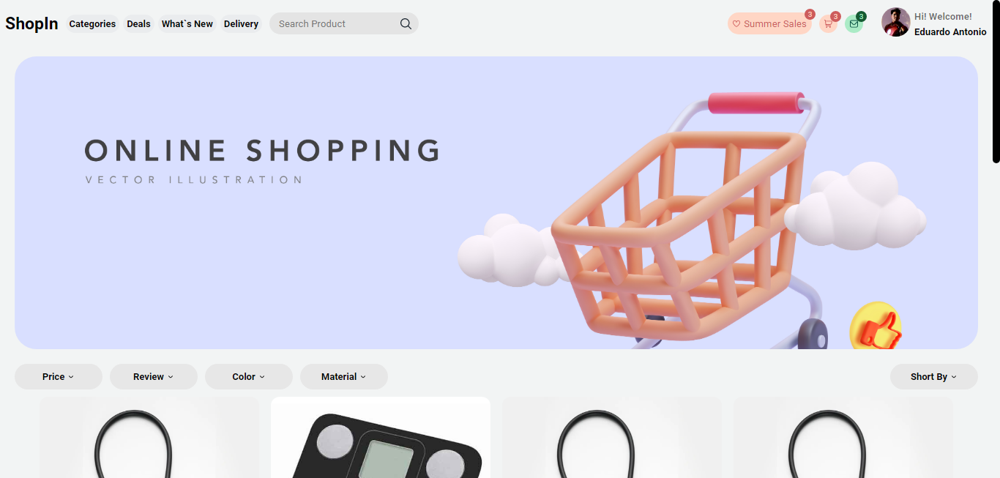

<h1 align='center'>Ecommerce</h1>

Our project is an e-commerce platform that allows users to buy and sell products quickly and securely. Our website has custom styles made in Sass and is developed with ReactJS and TypeScript using the ViteJS framework. In addition, we have a backend made with Flask and Python that is responsible for serving user and product data to the customer, as well as performing authentications. We are constantly working on improvements and new features to offer the best shopping experience to our users.

# Status

### Warning ! This project is still under development and too many features are missing.

# Preview Proyect

# Technologies used

- ReactJS
- Sass
- TypeScript
